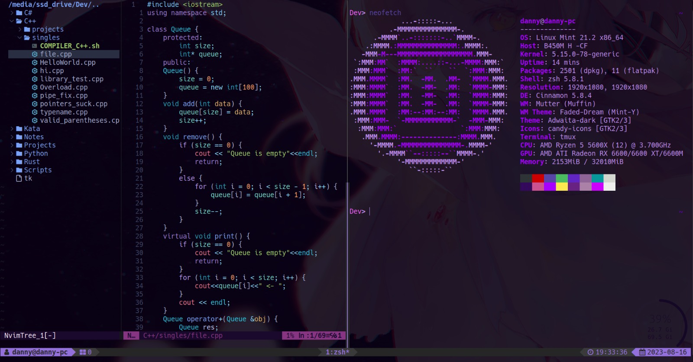

# Dannyrobrom's dotfiles



## About me

I am still a student, my experience in programming is self-taught but I study IT in school. I'm very passionate about computer science and many of its fields interest me. I aim towards becoming a Full Stack developer, but also heavily consider cybersecurity as another carreer option. My main OS is linux, debian based.

*Why is this important?*, all of my configs are catered to a very particular taste, heavily influenced by the tasks I need to do. Since I have diverse interests, my configs allow me to do **all sorts of helpfull and fun stuff**. But mostly, aimed towards **the following skills**:

- Linux scripting
- Python programming
- C/C++ programming
- Rust programming
- Currently Learning C# and integrating to NVIM
- NeoVim as main editor
- Assembly and RE with Ghidra
- Git

### Future integrations

- Frontend development
- JavaScript (will need it further in school)
- List of dependencies and programs needed for a complete experience

## Neovim Features

- Telescope
- Harpoon (fast n easy file switching made by ThePrimeagen)
- Treesitter highliting
- LSP and autocomplete
- Git integration
- Very nice themeing, tokyo colourscheme with transparences and purple accents on airline
- Mason plugin management
- Nvim tree for file navigation with nice simple icons
- Undotree with physical backup on system dirs
- Added tmux configuration and neovim compatibility (move between panels with C-vim movement motions hjkl)

### Neovim AppImage

For stability, I have uploaded the version of nvim I use. This way, i ensure that if you use this version (v9.1.x) it will be compatible with my configurations

## Terminal Features (ZSH)

- Simple effective prompt
- Git integration
- Syntax highlighting
- Autocomplete with history
- Useful aliases
- Command autosuggestions and help with ```[TAB]```

